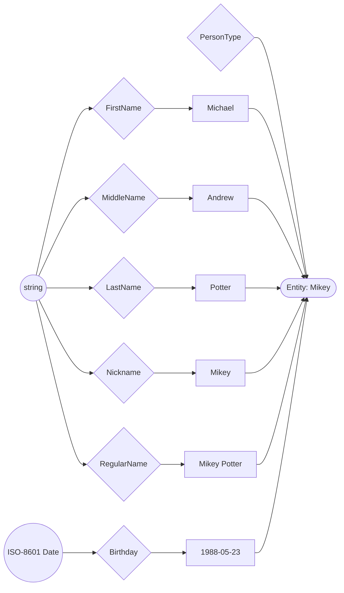
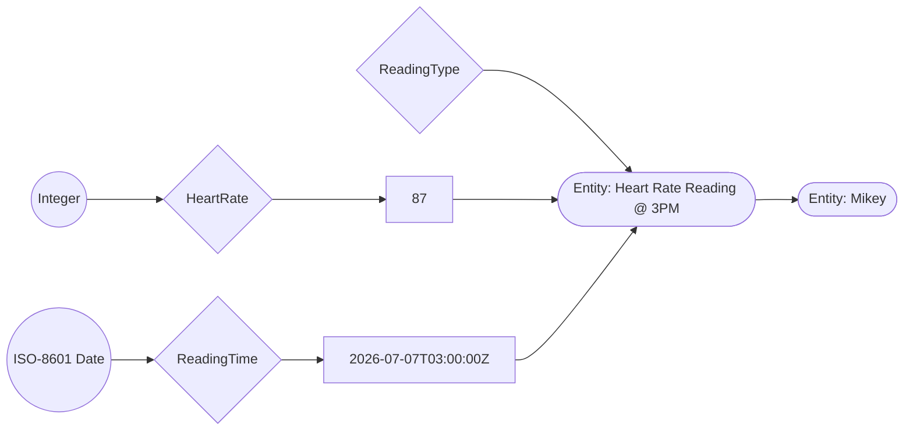
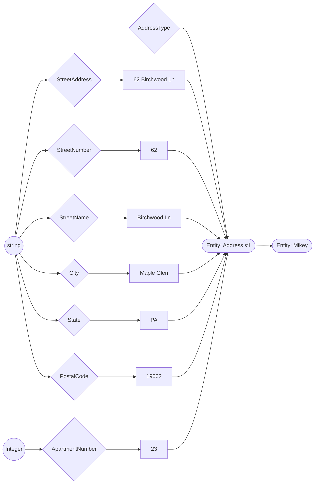
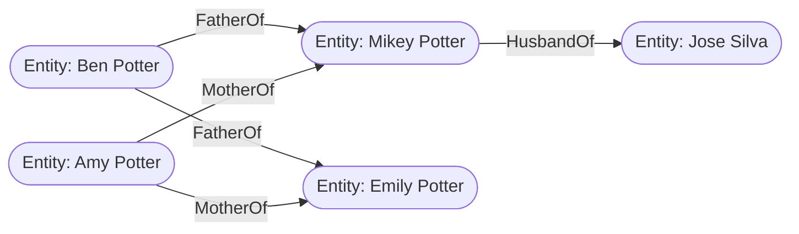
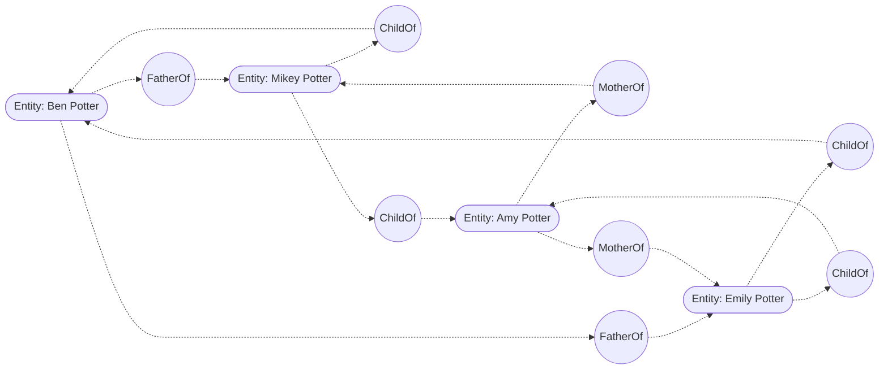
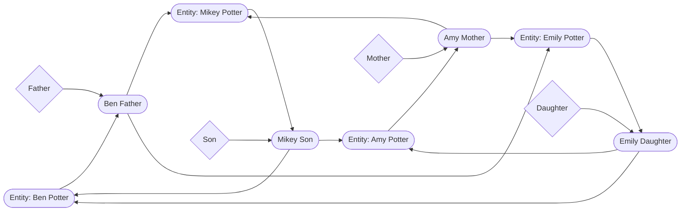
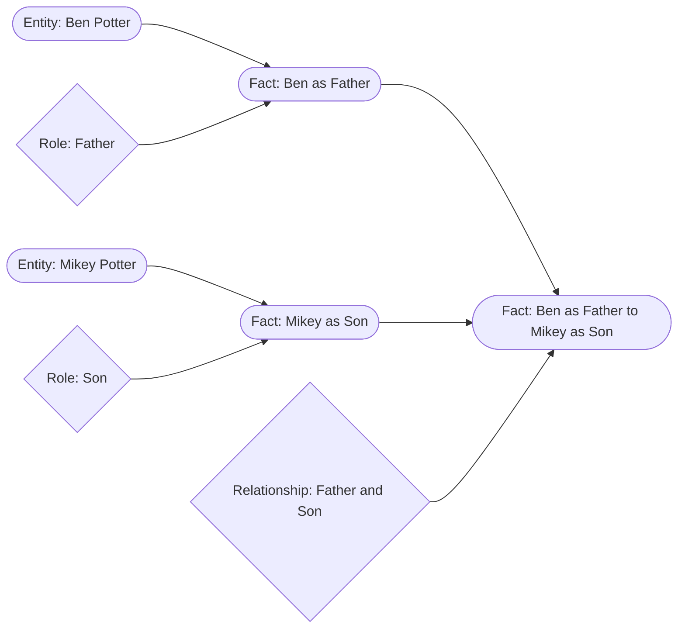

# The Database of Everything

DBOE is a concept project that evolved as I began to record and relate information about my life and the world that I encountered.

## Thesis

As a species, humanity has created many ways of measuring, categorizing, and relating information over time. In the computer age, this information is stored in data structures.

### Case Study: `Person`

A very popular data example used in teaching programming is `Person`. Following is a simple representation of a student in Go:

```go
type Person struct {
	Name     string
  Birthday time.Time
  Email    string
}
```

Immediately we can see a compression of data. Take the `name` field for example. If `name` is a simple `string`, we lose information such as first, middle, and last names. So let's make a `Name` struct:

```go
type Name struct {
  First  string
  Middle string
  Last   string
}
```

But most people don't actually go by their full name. In fact, many people have nicknames.

```go
type Name struct {
  ...
  RegularName string
  Nickname    string
}
```

But that only covers one culture of names. What about a Japanese name?

```go
type JapaneseName struct {
  Family string
  Given  string
}
```

As you can see, defining such strong types limits real-world representation

### Modeling the Real World

I propose a new model, one without rigid objects. Instead of creating a type with known fields, we can create a simple entity with related tags and values.

This breaks up our original `Person` type into individual values. Each value has a type, and is linked to the individual `Person` to which they apply.

In these diagrams: circles are base types, diamonds are custom types/tags, rectangles are values, and stadium shapes are entities.



Thus, the moment there is information of a new type for an entity, it can be clearly created and linked to that entity. Richer data can also be associated, such as a heart-rate reading:



The same pattern can model an address while preserving both combined and decomposed values:



There is no restriction of record types that can be linked together. In this one example, we have seen links from type `PersonType`, value `Potter`, and entity `Heart Rate Reading @ 3PM` to entity `Mikey`.

This free association is much more representitive of the world as we experience it.

Let's explore more complex relationships. Take Mikey's immediate family, for example:



Here we see the graph start to emerge, along with more questions. How should directional relationships be represented? In this particular representation, there are directed links from parent to child. There is no implication of any relationship of child to parent.

Should there be a sibling link? If so, does it have a direction? What if we can apply links to links?

The following graph illustrates directional labled edges:



This graph shows linked entities rather than linked links.



This graph shows another variation for Ben and Mikey, where each individual fact is an entity.


