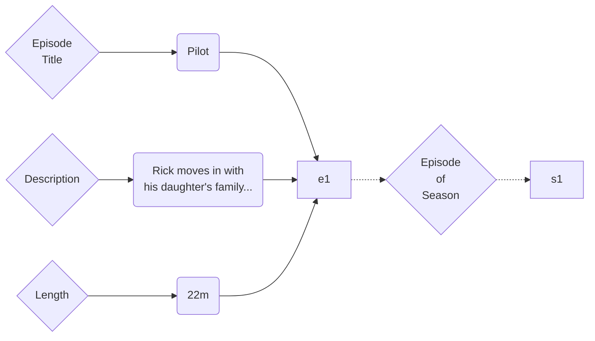

## Use



## Types

### Value

```json
[
  {
    "id": "4cf7c8fe-0534-4234-91fb-5b3e250cf9e4",
    "l": "Episode Title",
    "s": "core:string"
  },
  {
    "id": "8db36ca4-21c5-467b-a44d-1b36fee12aa7",
    "l": "Description",
    "s": "core:string"
  },
  {
    "id": "2dc5414d-00d7-4a95-8dd6-24c6c4fca319",
    "l": "Length",
    "s": "time:duration",
  }
]
```

### Link

```json
[
  {
    "id": "d24d6ad6-6865-4d11-9914-b8230789a7f6",
    "l": "Episode of Season"
  }
]
```

## Data


### Value 

```json
[
  {
    "id": "9b46cc12-b9f1-46e1-9305-b2c87eb9f946",
    "t": "4cf7c8fe-0534-4234-91fb-5b3e250cf9e4",
    "p": "a2424467-9e39-4070-ac04-5ec2892d837f",
    "ts": "now",
    "v": "Polit"
  },
  {
    "id": "f6c5b08e-c05c-4db7-b94f-0bdc30155310", 
    "t": "8db36ca4-21c5-467b-a44d-1b36fee12aa7",
    "p": "a2424467-9e39-4070-ac04-5ec2892d837f",
    "ts": "now",
    "v": "Rick moves in with his daughter's family and establishes himiself as ..."
  },
  {
    "id": "e92331e1-06ae-4a25-8b3c-e6d71437e072",
    "t": "2dc5414d-00d7-4a95-8dd6-24c6c4fca319",
    "p": "a2424467-9e39-4070-ac04-5ec2892d837f",
    "ts": "now",
    "v": "22m"
  },
  {
    "id": "9b46cc12-b9f1-46e1-9305-b2c87eb9f946",
    "t": "4cf7c8fe-0534-4234-91fb-5b3e250cf9e4",
    "p": "a2424467-9e39-4070-ac04-5ec2892d837f",
    "ts": "later",
    "v": "Pilot"
  }
]
```

### Link

```json
[
  {
    "id": "cd18c724-120f-41f9-9c03-d5b5c0dc235c",
    "t": "d24d6ad6-6865-4d11-9914-b8230789a7f6",
    "ts": "now",
    "a": "a2424467-9e39-4070-ac04-5ec2892d837f",
    "b": "eafa7992-c2a4-4187-966d-bd2a55034c90"
  }
]
```

### Tombstones

```json
[]
```